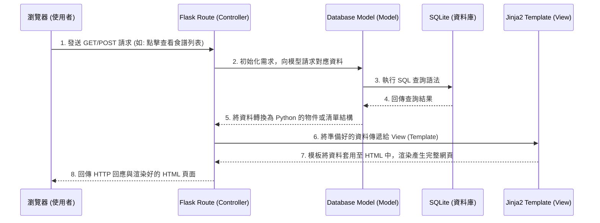

# 系統架構文件 (Architecture) - 食譜收藏夾

## 1. 技術架構說明

### 選用技術與原因
- **後端框架：Python + Flask**
  - **原因**：Flask 是輕量級且靈活的框架，非常適合用來快速建構從小型到中型的單體式（Monolithic）應用程式如「食譜收藏夾」。它容易理解、學習曲線平緩，且擁有豐富的擴充套件。
- **模板引擎：Jinja2**
  - **原因**：與 Flask 深度整合，能讓伺服器端在回傳 HTML 給瀏覽器前，安全且動態地把後端 Python 處理好的食譜與食材資料渲染到頁面上。本專案不採前後端分離，藉此大幅降低開發初期的複雜度與時間成本。
- **資料庫：SQLite (搭配 SQLAlchemy 或內建 sqlite3)**
  - **原因**：SQLite 不需要額外安裝、設定與維護資料庫伺服器，資料儲存在單一的本機檔案中，非常適合中小型專案以及 MVP 開發使用。

### Flask MVC 模式說明
本專案採用類似 MVC (Model-View-Controller) 的架構來分離程式碼職責：
- **Model (模型)**：負責處理與資料庫的溝通與結構定義（如：定義 `Recipe` 食譜表、`Ingredient` 食材表），並封裝資料的新增、讀取、更新、刪除 (CRUD) 操作邏輯。
- **View (視圖)**：Jinja2 模板（位於 `templates/`），負責編排 HTML 結構，將 Controller 準備好的資料渲染為最終的使用者介面。
- **Controller (控制器)**：Flask 的路由函式（位於 `routes/` ），負責接收從瀏覽器傳來的 HTTP 請求（例如：提交「新增食譜」的表單），去呼叫 Model 操作資料，最後將結果傳送給對應的 View 進行畫面渲染。

---

## 2. 專案資料夾結構

以下為建議的專案目錄結構設計：

```text
web_app_development/
├── app/                        # 應用程式的主目錄
│   ├── __init__.py             # 初始化 Flask 應用與設定檔
│   ├── models/                 # 資料庫模型 (Models)
│   │   ├── __init__.py
│   │   ├── recipe.py           # 食譜相關資料表 (包含步驟與分類)
│   │   └── ingredient.py       # 食材庫相關資料表
│   ├── routes/                 # 路由控制器 (Controllers)
│   │   ├── __init__.py
│   │   ├── recipe_routes.py    # 食譜 CRUD、搜尋、分類等路由設定
│   │   └── ingredient_routes.py# 食材庫的 CRUD 路由設定
│   ├── templates/              # HTML 模板設計 (Views)
│   │   ├── base.html           # 全域共用版面 (包含 CSS 引入與共同導覽列)
│   │   ├── recipes/            # 食譜相關頁面 (如：清單、新增、編輯、詳細觀看)
│   │   └── ingredients/        # 食材相關頁面
│   └── static/                 # 靜態資源檔案
│       ├── css/
│       │   └── style.css       # 系統共用與自訂樣式設定
│       ├── js/
│       │   └── main.js         # 前端簡易互動處理 (如食材選項動態載入等)
│       └── images/             # 存放全站公用圖片或預設圖片
├── instance/
│   └── database.db             # SQLite 實體資料庫檔案 (通常啟動後自動產生)
├── docs/                       # 專案說明文件目錄
│   ├── PRD.md                  # 產品需求文件
│   └── ARCHITECTURE.md         # 系統架構文件 (本文件)
├── requirements.txt            # Python 的套件依賴清單
├── .gitignore                  # Git 忽略清單 (需排除 instance 資料夾及虛擬環境)
└── app.py                      # 系統啟動主程式入口 (Entry Point)
```

---

## 3. 元件關係圖

以下展示使用者如何透過瀏覽器與我們的伺服器架構進行互動的流程圖：



---

## 4. 關鍵設計決策

1. **依功能模組拆分路由機制**
   - **原因**：為了避免日後邏輯全部塞在單一 `app.py` 中變得難以維護，我們將路由依照系統功能分別放置於 `recipe_routes.py` 和 `ingredient_routes.py`。這種拆分法讓程式碼易於查找與共編，未來如果要新增擴充功能，只需新增對應的檔案加入註冊即可。

2. **採用傳統伺服器端渲染 (SSR)**
   - **原因**：為了能以最快速度完成這個 MVP 系統並降低技術複雜度，我們不導入 React 或 Vue 此類前端框架，而是讓 Flask 與 Jinja2 在後端處理好所有的前端 HTML。這對於一個以「內容展示、表單提交」為主的系統來說，是非常穩健且開發速度極快的選擇。

3. **統一使用公用基本模板 (Base Template)**
   - **原因**：透過在 `templates/base.html` 中寫好共用的導覽列與外框結構，其他所有的子頁面都只需透過 `` 來繼承外觀。這除了能減少程式碼重複之外，也確保了全站風格統一同等重要。未來若要更改側邊欄或頂部選單，同樣也只需改動一份檔案。

4. **採用關聯機制處理多對多 (M:N) 資料**
   - **原因**：「一份食譜會有多項食材」，「一項食材也會涵蓋入多種不同的食譜中」，這是在食譜庫中非常典型的多對多資料關係。我們會在 SQLite 中規劃一個中介資料表 (Association Table) 來妥善記載「食譜」與「食材」的依賴對應關係，這會比單純將食材當純文字字串存入食譜欄位更有延展性，也方便未來實作「從冰箱有的食材，反向找尋適合做的食譜」這項功能。
