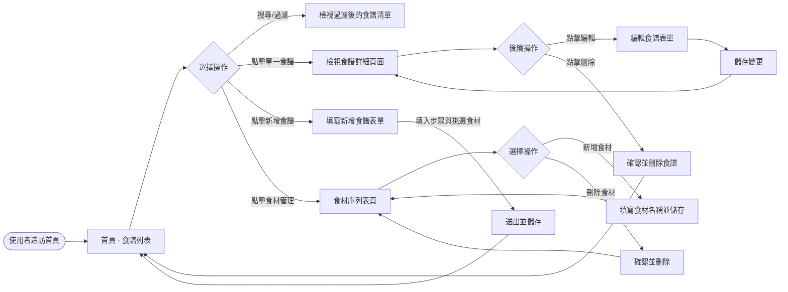
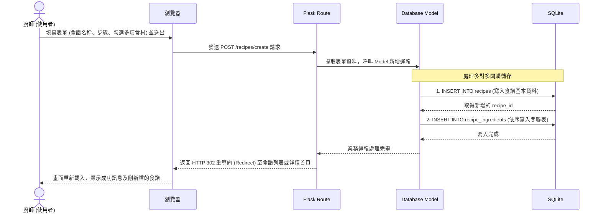

# 系統流程圖與功能對照表 - 食譜收藏夾

本文件涵蓋了「食譜收藏夾」的使用者操作流程（User Flow）、系統處理資料流程（System Sequence Diagram），以及各功能對應的 URL 路由與 HTTP 方法。

## 1. 使用者流程圖 (User Flow)

描述使用者在系統中瀏覽、搜尋、新增、管理食譜及食材的操作路徑。

## 2. 系統序列圖 (Sequence Diagram)

以下以「使用者送出新增食譜」為例，描述從前端送出到資料存入資料庫的完整技術流向。

## 3. 功能清單對照表

對應 PRD 與架構設計，以下整理出本專案核心功能的路由規劃。

| 功能區塊 | 操作行為 | URL 路徑 | HTTP 方法 | 說明 |
| :--- | :--- | :--- | :--- | :--- |
| **食譜功能** | 顯示所有食譜 | `/` 或 `/recipes` | GET | 首頁，顯示食譜清單，可附帶搜尋查詢參數 |
| **食譜功能** | 顯示詳細內容 | `/recipes/<id>` | GET | 顯示單一食譜的材料清單、完整步驟與標籤 |
| **食譜功能** | 顯示新增表單 | `/recipes/create` | GET | 呈現新增食譜的空白 HTML 表單 |
| **食譜功能** | 處理新增資料 | `/recipes/create` | POST | 接收前端表單並將食譜與食材寫入資料庫 |
| **食譜功能** | 顯示編輯表單 | `/recipes/<id>/edit` | GET | 呈現預先載入舊資料的食譜編輯表單 |
| **食譜功能** | 處理變更資料 | `/recipes/<id>/edit` | POST | 更新資料庫中的食譜資訊與對應的食材關聯 |
| **食譜功能** | 執行刪除動作 | `/recipes/<id>/delete`| POST | 安全性考量，使用 POST 刪除特定食譜 |
| **食材管理** | 預覽已有食材 | `/ingredients` | GET | 顯示目前食材庫中的所有可用食材 |
| **食材管理** | 新增未知食材 | `/ingredients/create` | POST | 加入一筆新食材至系統供未來直接選用 |
| **食材管理** | 刪除閒置食材 | `/ingredients/<id>/delete`| POST | 刪除不再需要的自訂食材 |
